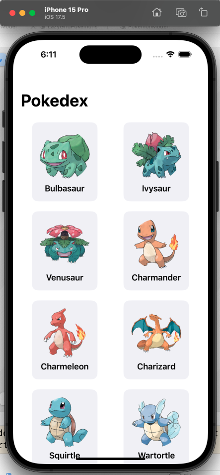

# pokedex
## **Pokedex App: Pokemon Explorer** 🕵️‍♂️🎮 

This project is a Pokedex app built using Express and Node.js that consumes the Pokemon API to display detailed information about various Pokemon species. The backend is hosted locally on port 8080, serving as a gateway to fetch and organize data from the API.

The app allows users to search for their favorite Pokemon, view key details such as abilities, types, and stats, and explore different species with an intuitive interface. This project provided hands-on experience in building RESTful APIs with Express, managing asynchronous requests, and connecting frontend and backend services smoothly.

  

